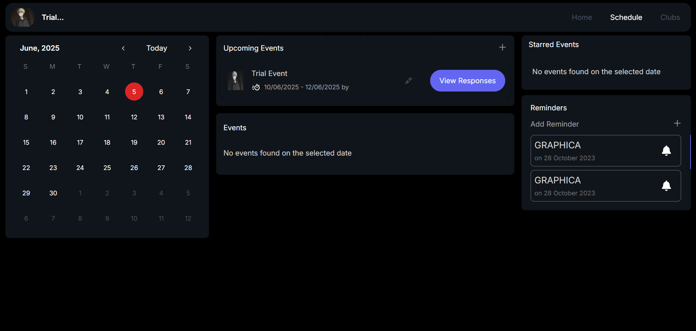
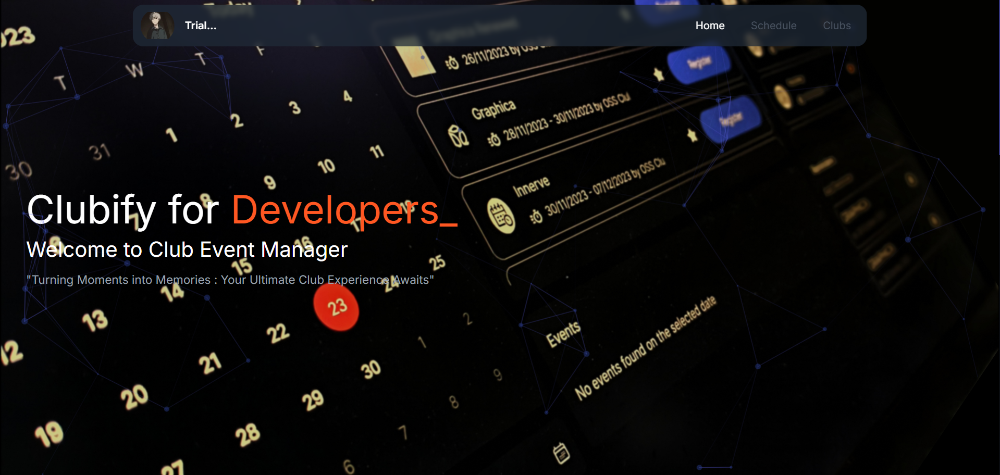

# Clubify

**Clubify** is a club management platform that provides an all-in-one solution for managing college clubs, organizing events, sending reminders, and enhancing student engagement. It is designed to simplify administration and make student club experiences more interactive and organized.

## 🚀 Features

- 🔐 User Authentication (Admin & Student roles)
- 📅 Event Scheduling and Calendar Integration
- 🔔 Smart Event Reminders
- 📊 Dashboard for Admins
- 🧑‍💻 Browse Clubs and Join Events
- 📁 Responsive UI with React and Tailwind CSS

## 🧪 Admin Access (Trial)

To explore the admin dashboard and features without registering, you can log in with the following **trial credentials**:

Email: trial_user@gmail.com
Password: admin


> ⚠️ This account has full admin privileges. Use it to access all features such as creating clubs, managing members, sending reminders, and more.

## 🛠️ Tech Stack

- **Frontend:** React, Tailwind CSS, TypeScript
- **Backend:** Supabase
- **Authentication:** Supabase Auth
- **Icons & Styling:** React Icons, ShadCN

## 📦 Installation

1. **Clone the Repository**

```bash
git clone https://github.com/Binit06/Club_Event_Manager.git
cd clubify

```

2. **Install Dependencies**

```bash
npm install
```

3. **Start the Development Server**

```bash
npm run dev
```

4. **Screenshots**


